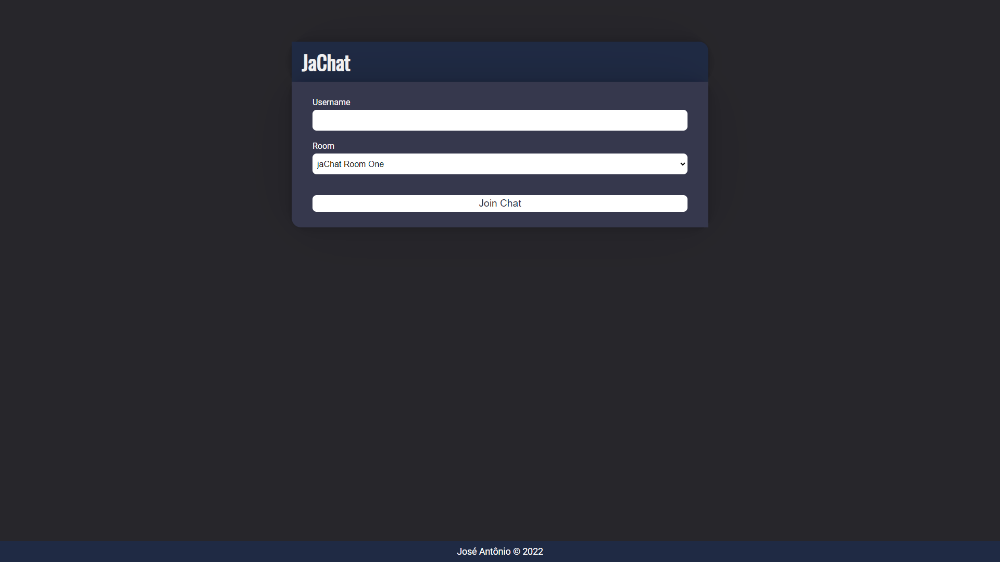
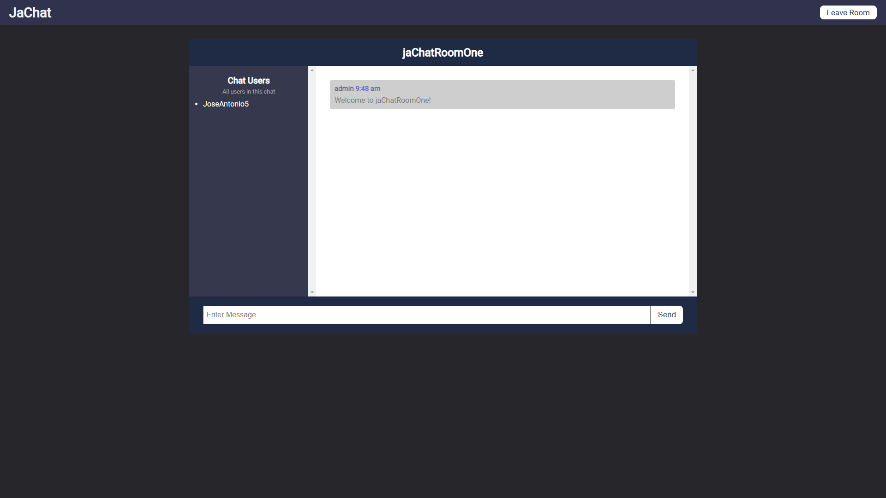
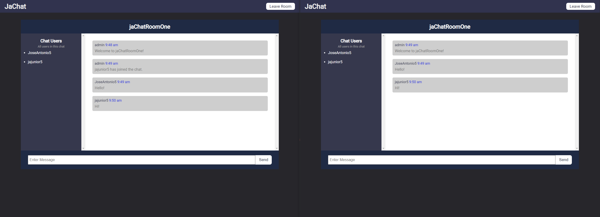

# JaChat Realtime Chat App 💬

##  About The Project 📖
This project is a real time chat application created using Socket.IO, which is an amazing library that enables real-time, bi-directional communication between web clients and servers. I used [Node.js](https://nodejs.org/en/) and [Express](https://expressjs.com/) to create a webserver and handle the socketIO logic, and HTML, CSS and JavaScript to show the output on the user screen.

> Enter a username and select room to join a chat

> Chat page

> Chat page with two users sending messages


### Basic Features
- Users can enter a username and join a room.
- There are many different chat rooms.
- Chatting in real-time.

##  🚀 Installation
> Instructions to run the project on your device.
1. Clone the repo
   ```sh
   https://github.com/JoseAntonio5/JaChat-Realtime-Chat-App.git
   ```
2. Run `npm install` in the terminal to install app the packages
3. Run `npm start` in the terminal to start the application
Open [http://localhost:3000](http://localhost:3000) to view it in your browser.

####  Author
José Antônio ©️ 2022
